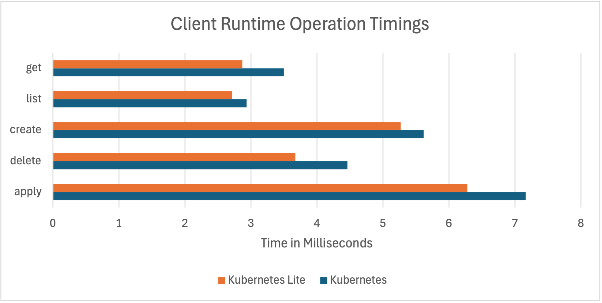
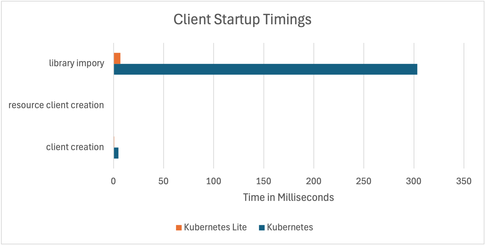
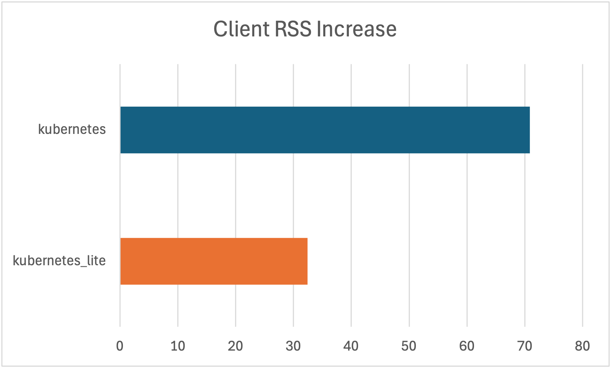

# Kubernetes Lite

**Kubernetes Lite** is a lightweight Python wrapper around key Go-based Kubernetes libraries like [`client-go`](https://k8s.io/client-go), [`controller-runtime`](https://pkg.go.dev/sigs.k8s.io/controller-runtime), and [`envtest`](https://book.kubebuilder.io/reference/envtest.html) made accessible through [gopy](https://github.com/go-python/gopy). It combines Go’s performance with Python’s ease of use—offering faster client operations, reduced memory overhead, and best-in-class testing capabilities.

---

## 🚀 Why Kubernetes Lite?

* ⚡ **Up to 20% faster** than the standard Python client.
* 🧪 **Best-in-class testing tools**: Run a full Kubernetes control plane locally—no containers or mocks needed. 
    * 🔧 **Fully Compatible** with existing Python Kubernetes clients like [`kubernetes`](https://pypi.org/project/kubernetes/).
* 🧠 **Unified Go + Python** interface: Leverage Go’s resource-efficient internals while writing Python code.

---

## 🔬 Built-In Testing with EnvTest

Kubernetes Lite provides Python bindings to Go's [`envtest`](https://pkg.go.dev/sigs.k8s.io/controller-runtime/pkg/envtest)—an isolated, real Kubernetes control plane for testing your Python clients and controllers. This eliminates the need for mocking or spinning up complex test environments.

✅ Works with *any* Kubernetes client
✅ Seamless integration with `pytest`
✅ Mirrors Go’s native test workflow, including support for `KUBEBUILDER_ASSETS` and `USE_EXISTING_CLUSTER`

**Example: Using EnvTest with the official Kubernetes client**

```python
from kubernetes import client, config
from kubernetes_lite.envtest import EnvTest
from kubernetes_lite.envtest.pytest import session_kubernetes_env

def test_kubernetes_core_api(session_kubernetes_env: EnvTest):
    config.load_config(config_file=session_kubernetes_env.config())
    v1 = client.CoreV1Api()
    pods = v1.list_pod_for_all_namespaces(watch=False)
    for i in pods.items:
        print(f"{i.status.pod_ip}\t{i.metadata.namespace}\t{i.metadata.name}")
```

---

## 🧰 Compatible and Lightweight Client

Kubernetes Lite exposes `client-go`’s powerful [dynamic client](https://k8s.io/client-go/dynamic) with full compatibility with Kubernetes [apimachinery](https://pkg.go.dev/k8s.io/apimachinery) options (both JSON and camelCase formats).

```python
from kubernetes_lite.client import DynamicClient

client = DynamicClient()
client.resource("apps/v1", "Deployment").list()
```

📉 **Benchmark results**:

* 🚀 \~20% faster client operations
* 🧠 \~50% lower memory usage
* ⚡ 300ms+ faster startup—ideal for CLI tools or cron jobs

> [!NOTE]
> One caveat is that the "20%" runtime improvement is on top of a fast standard client. The official client is only 1-3ms behind Kubernetes Lite, which would not impact a networked client where network latencies usually are much higher than 1ms.





---

## 📦 Installation

> [!WARNING]
> Due to Go limitations in version 1.21+, multiple CGO shared libraries are not supported in the same process. Avoid using other Go-based Python libraries alongside `kubernetes_lite`. [Details](https://github.com/golang/go/issues/65050#issue-2074509727)


We provide precompiled wheels for x86 and ARM on Linux and macOS:

```bash
pip3 install kubernetes_lite
```

### From Source

Make sure you have Go 1.23+ installed:

```bash
pip3 install --no-binary "kubernetes_lite" kubernetes_lite
```

---

## 🛠 Setup EnvTest (CLI)

To aid in setting up `envtest` we also provide a wrapper around the [`setup-envtest`](https://pkg.go.dev/sigs.k8s.io/controller-runtime/tools/setup-envtest) cli:

```bash
python3 -m kubernetes_lite.setup_envtest use
```

Output:

```
Version: 1.32.0
OS/Arch: darwin/amd64
Path: /Users/yourname/.../k8s/1.32.0-darwin-amd64
```

You may use it manually before running your tests or let the `EnvTest` class handle it automatically during startup.

---

## 📚 Documentation

* 🔎 [Examples](https://ibm.github.io/Kubernetes-Lite/examples/)
* 📖 [API Reference](https://ibm.github.io/Kubernetes-Lite/api_references/)

---

## 🤝 Contributing

We welcome contributions of all kinds! See our [contributing guide](CONTRIBUTING.md).

---

## 🧭 Code of Conduct

Please review our [Code of Conduct](code-of-conduct.md) before contributing.