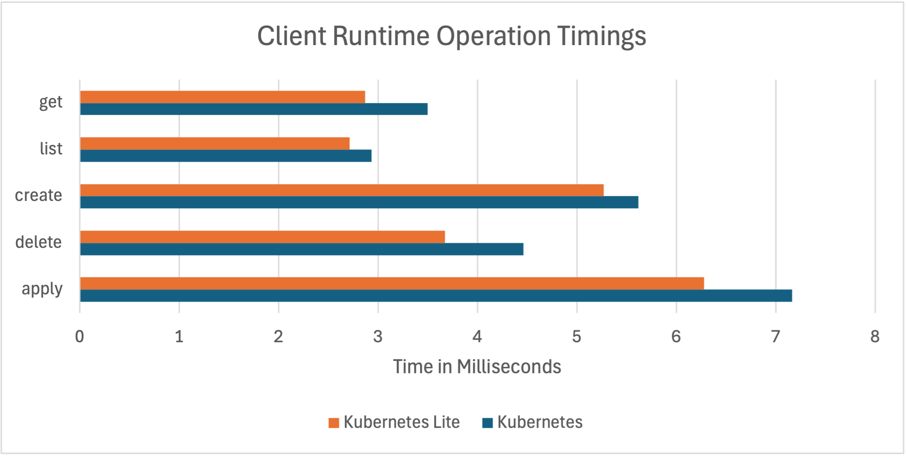
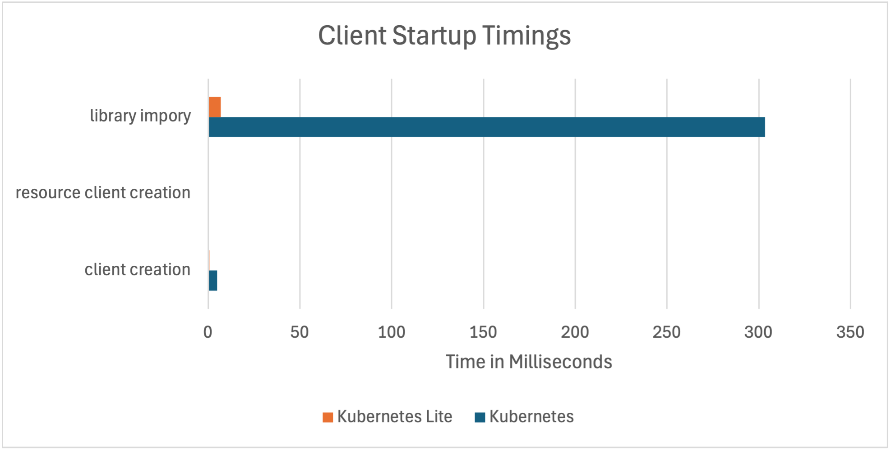
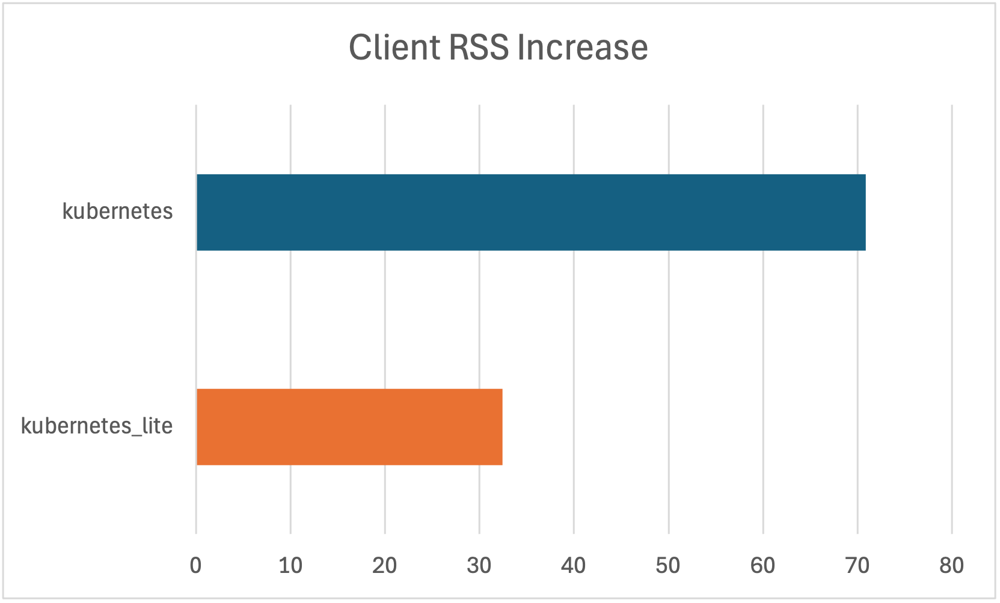

# Kubernetes Lite

Kubernetes Lite is a "liteweight" wrapper around various golang Kubernetes libraries using [gopy](https://github.com/go-python/gopy). It brings the benefits of go's resource efficiency plus the feature set of packages like [client-go](https://k8s.io/client-go) and the [controller-runtime](https://pkg.go.dev/sigs.k8s.io/controller-runtime) to Python. 

## Examples

For examples using the library please continue reading down bellow or checkout our [examples](./examples/) folder

## Installation

Kubernetes Lite provides precompiled both x86 and arm wheels for Linux and MacOS. You can install the package with the standard `pip install`

```sh
pip3 install kubernetes_lite
```

### Source Installation

To install Kubernetes Lite from source you will need to install [golang](https://go.dev/doc/install) 1.23. You should then be able to let setup-tools/pip install the package like normal.

```sh
pip3 install --no-binary "kubernetes_lite" kubernetes_lite
```

## Dynamic Client

Kubernetes Lite exposes client-go's [dynamic client](https://k8s.io/client-go/dynamic), which, on average, is 20% faster and uses half the memory than the standard Kubernetes library. It supports all of the options defined by [apimachinery](https://pkg.go.dev/k8s.io/apimachinery/pkg/apis/meta/v1) in both their JSON and camelCase formats. See the [examples folder](./examples/dynamic_create_update_delete_deployment.py) for a recreation of client-go's own [dynamic example](https://github.com/kubernetes/client-go/blob/master/examples/dynamic-create-update-delete-deployment/main.go).

In addition to [the usage example](./examples/dynamic_create_update_delete_deployment.py) you can check out the [Api Reference]() for a detailed description of all methods and options.

```python
from kubernetes_lite.client import DynamicClient

# Construct a client using https://pkg.go.dev/sigs.k8s.io/controller-runtime/pkg/client/config#GetConfig
client = DynamicClient()
# List all deployments in a cluster
client.resource("apps/v1","Deployment").list()
```

The following graph's highlight the speed and efficiency of the dynamic client. One caveat is that the "20%" runtime improvement is ontop an already fast standard client. The official client is only 1-3ms behind Kubernetes Lite which would not have an impact on a networked client where network latencies are normally much higher then 1ms. The real benefit of Kubernetes Lite's resource efficiency is startup time. If you have a simple script which needs to be ran at frequent intervals, the startup save of 300ms can be impactful.





## EnvTest

To aid in testing all Python Kubernetes libraries, Kuberetes Lite also provides bindings to the controller-runtime's [envtest](https://sigs.k8s.io/controller-runtime/pkg/envtest) package. This allows you to start a local control plane without needing a container runtime, which provides users real API server to test against, replacing the need for complicated "mock" clients and servers. These bindings and pytest fixtures work with any Kubernetes client including the official one as shown in [our examples folder.](./examples/test_kubernetes.py) 

```python
# Import standard Kubernetes client
from kubernetes import client, config
# Import Kubernetes Lite Fixture
from kubernetes_lite.envtest.pytest import session_kubernetes_env, EnvTest

def test_kubernetes_core_api(session_kubernetes_env: EnvTest):
    """Test that kubernetes core api works with envtest"""
    config.load_config(config_file=session_kubernetes_env.config())

    v1 = client.CoreV1Api()
    print("Listing pods with their IPs:")
    ret = v1.list_pod_for_all_namespaces(watch=False)
    for i in ret.items:
        print(f"{i.status.pod_ip}\t{i.metadata.namespace}\t{i.metadata.name}")
```

The `EnvTest` class was designed to be compatible with the controller-runtime version. It uses the same environmental configuration as go with support for envvars like `KUBEBUILDER_ASSETS` and `USE_EXISTING_CLUSTER`. For a full guide to envtest checkout the controller-runtimes [Configuring Envtest](https://book.kubebuilder.io/reference/envtest.html) guide. The code snippets will be different and instead of `setup-envtest` it will be `python3 -m kubernetes_lite.setup_envtest` but other than that the guide is still applicable.

## Setup EnvTest

Along with envtest, Kubernetes Lite wraps it's helper script [setup-envtest](https://pkg.go.dev/sigs.k8s.io/controller-runtime/tools/setup-envtest). This script is automatically called when starting an `EnvTest` instance but it can also be invoked manually with `python3 -m kubernetes_lite.setup_envtest`. It has the exact same options and use as the go version.

```sh
❯ python3 -m kubernetes_lite.setup_envtest use
Version: 1.32.0
OS/Arch: darwin/amd64
sha512: a7824ff8ae9c5062bcbde243a7a3a1c76e02de0c92e2b332daf1954405aeded856023f277d74197862d0d5909e9e1dca451b5f2e84796e451ad6011ec98f8433
Path: /Users/michaelhonaker/Library/Application Support/io.kubebuilder.envtest/k8s/1.32.0-darwin-amd64
```
